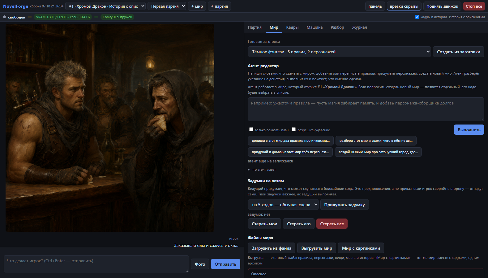
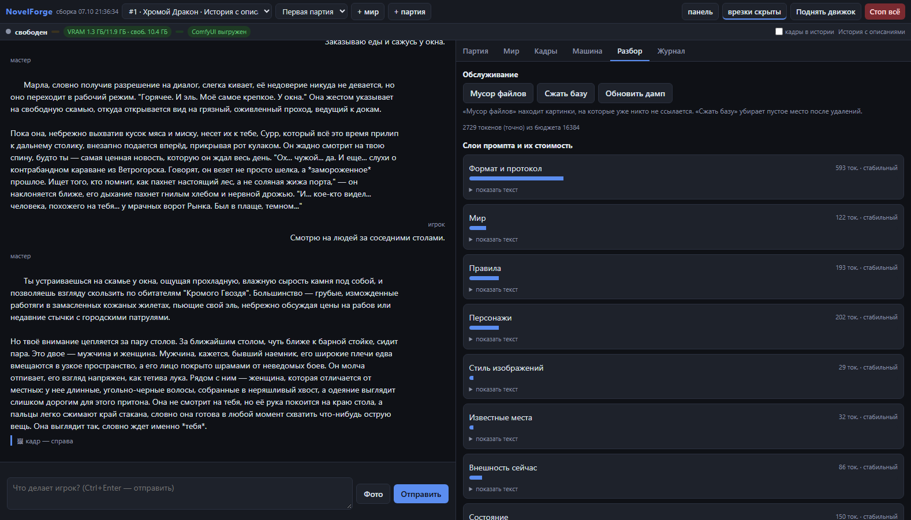
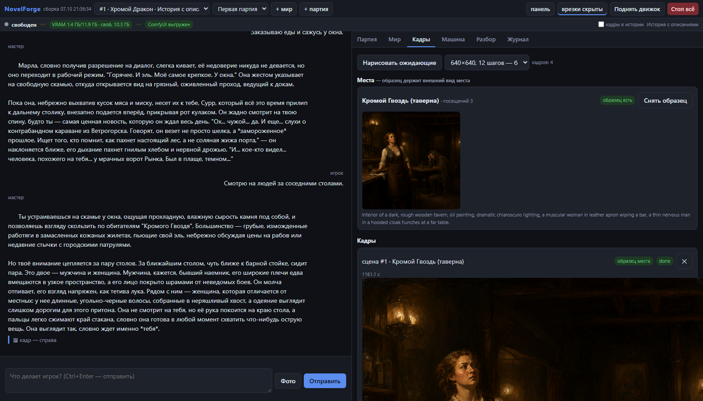

# NovelForge

Локальная графическая новелла: LLM ведёт историю, ComfyUI рисует сцены.
Всё офлайн.

Вы пишете, что делает ваш герой, — мастер отвечает продолжением: что вы
увидели, кто заговорил, что изменилось. Мир, правила, персонажи и память
остаются между ходами, поэтому это не одноразовый чат, а длинная история.
К смене сцены рисуется иллюстрация.

Играть можно одному и без интернета: и текст, и картинки считает ваша машина.

## Агент-редактор

Отдельная часть программы — агент, который настраивает игру по вашему описанию.
Ему можно сказать словами: «сделай мир про затонувший город, где память хранят
в бутылках», «перепиши второе правило жёстче», «добавь трёх персонажей». Агент
разберёт указание на действия, выполнит их и покажет, что именно сделал.

Работает это на той же модели, что ведёт историю: отдельный движок для настройки
не нужен. Модель сама придумывает мир, правила и персонажей, заполняет жанр, тон
и стиль иллюстраций. Есть режим «только показать план» — посмотреть, что агент
собирается сделать, и не применять. И запрет на удаление без явного разрешения.

Тот же агент умеет писать с командной строки: `bench/author.py`.

## Какие модели подойдут

Программа не привязана к конкретным моделям: вы выбираете свои.

**Текст.** Два движка на выбор, переключатель во вкладке «Машина»:

| Движок | Что грузит | Кто запускает |
|---|---|---|
| FreeToken | каталоги Hugging Face и родной формат FTW | NovelForge сам |
| llama.cpp | GGUF-файлы | NovelForge сам, если разрешено в настройках |

Список моделей программа **получает от вас**: она обходит указанные каталоги и
показывает, что нашла, вместе с размером и типом. Вы выбираете из списка — и
дальше программа сама подставляет параметры сэмплинга под семейство модели.

**Картинки.** Генератор — ComfyUI, модель тоже ваша. Программа ищет подходящие
файлы в каталогах ComfyUI сама, а если подходящих несколько — нужный задаётся
настройкой.

**Принимает ли модель картинки на входе** — зависит от вашей модели, а не от
программы. Одни умеют смотреть на приложенный снимок, другие только читают
текст. Программа проверяет это у выбранной модели и говорит прямо, что она
умеет; если модель не принимает изображения, вы об этом узнаете до игры, а не
по пустому ответу.

| Роль | Адрес |
|---|---|
| Текст | `127.0.0.1:1919` |
| Картинки | `127.0.0.1:8188` |
| Оркестратор и интерфейс | `127.0.0.1:8760` |

## Как выглядит

История идёт слева, иллюстрации — прямо в ней: так удобнее читать. Мастер
описывает сцену, к каждому ходу прикладывается кадр, а справа — вкладки партии,
мира, кадров, движка и разбора промпта.



Разбор показывает каждый слой промпта с его точной стоимостью в токенах: видно,
сколько занимают формат, мир, правила, персонажи и память и сколько остаётся от
бюджета.



Постоянные места: таверна запоминается вместе с кадром-образцом, и следующие
кадры этого места рисуются по нему. Насколько похожими выйдут кадры — зависит от
выбранной модели.



## Что умеет

**Миры и правила.** Мир — это описание, жанр, тон, стиль иллюстраций, список
правил и карточки персонажей. Описание можно написать свободным текстом, а
кнопка «Разобрать нейросетью» превратит его в структуру: жанр, тон, стиль, 3–8
правил и 2–6 персонажей с внешностью. Правится всё руками.

**Пять форматов диалога.** Формат задаёт и протокол ответа модели, и то, как
ответ рисуется:

| Формат | Что пишет модель | Картинка |
|---|---|---|
| История с описаниями | проза 2–4 абзаца | иллюстрация на смену сцены |
| История без описаний | только действия и реплики | иллюстрация |
| Просто чат | короткие сообщения мессенджера | нет |
| Чат с фотками | сообщения плюс вложение-фотография | вложение |
| Диалоги с картинками | реплики «Имя: текст» | кадр сцены |

**Управление контекстом.** Промпт собирается слоями: формат, мир, правила,
персонажи, стиль, состояние, память, окно истории. Слои с первого по шестой не
меняются между ходами и стоят в начале — движок кэширует префикс. Бюджет
токенов настраивается; когда история перестаёт помещаться, старые сообщения
сворачиваются в суммаризацию, которая поглощает предыдущую.

**Политики картинок.** `никогда`, `при смене сцены`, `каждый ход`, `каждые N
ходов`, `только по кнопке`, `в простое`. Промпт для генератора пишет либо сама
модель в блоке `<scene>`, либо отдельный короткий вызов — второй вариант дороже
по времени, но даёт более однородные кадры.

**Постоянные места.** Замок, таверна или площадь выглядят одинаково при каждом
возвращении: место запоминается вместе с кадром-образцом, и следующие кадры этого
места рисуются по нему. Образцом становится первый удачный кадр; если он не
понравился, образцом можно назначить любой другой в один щелчок. Зрение модели для
этого не нужно — образец уходит прямо в генератор изображений.

**Агент-редактор.** На вкладке «Отладка» можно написать словами, что сделать с
миром, — агент разберёт указание на действия, выполнит их и покажет, что именно
сделал. Добавить правило, переписать существующее, придумать персонажа, разобрать
мир на слабые места, создать новый мир по идее. Есть режим «только показать план»
и запрет на удаление без явного разрешения.

**Отладочная панель.** Показывает каждый слой промпта с его точной стоимостью в
токенах, отправленные сообщения, сырой ответ модели, расход токенов и тайминги.

**Починка на ходу.** Править текст ответа, удалять сообщения, откатывать партию
к любому моменту, очищать партию целиком, сворачивать историю вручную, запускать
проверки мира с подсказками.

**Размышления модели.** Reasoning-модели по умолчанию тратят бюджет ответа на
цепочку рассуждений и до текста не доходят: снаружи это выглядит как пустой
ответ при ненулевых токенах. Приложение читает из движка точные аргументы
отключения и подставляет их само; режим переключается в настройках.

**Контекст не растёт.** На 20, 50 и 100 сообщениях объём подсказки держится
около 1424, 1470 и 1437
токенов — сто сообщений стоят столько же, сколько двадцать. Время запроса
держится на 8.6 с.

**Картинки на входе.** Игрок прикладывает снимок к реплике, и модель его
описывает — но только если выбранная вами модель умеет смотреть на изображения.
Программа проверяет это у выбранной модели и говорит заранее, что она принимает.
Кадр 768×768 стоит **258 токенов**, то есть в бюджет помещается больше
пятидесяти изображений. `file://` потребовал бы отдельного флага запуска,
поэтому всё передаётся встроенными данными.

**Менеджер партий.** Партии создаются, переименовываются, очищаются и удаляются;
по каждой видна сводка — сообщения, токены ответов, сводки памяти, кадры.
Мир или отдельная партия выгружаются в JSON и загружаются обратно. Кнопка «Копия
базы» кладёт снимок рядом с оригиналом. Последняя открытая партия запоминается.

## Как это устроено

Текстовая модель и генератор изображений вместе не помещаются на слабой
видеокарте: свободной памяти остаётся меньше, чем нужно генератору. Поэтому
видеопамять переходит из рук в руки:

```
IDLE -> LLM_ACTIVE -> SWITCH_TO_IMAGE -> IMAGE_GEN -> SWITCH_TO_LLM -> IDLE
```

Движок останавливается целиком и поднимается заново. Картинки поэтому копятся в
очередь и рисуются пачкой за одно переключение, а не по одной на каждый ход.
Сервер ComfyUI живёт постоянно, оркестратор управляет только выгрузкой моделей
через `POST /free`.

Переключением занимается конечный автомат в `novel/machine.py`: он же ведёт
очередь кадров, следит за простоями и решает, когда рисовать следующий.

На мощной видеокарте это не нужно: там и текст, и картинки помещаются
одновременно, и переключений не происходит.

## Замеры на слабом железе

Ниже — не требования, а пример: всё измерено на ноутбуке с видеокартой 12 GB.
На такой машине переключение видеопамяти обязательно. На десктопной карте
побольше программа работает быстрее и без него.

Партия на 15 ходов, движок llama.cpp, модель 8B:

| Показатель | Значение |
|---|---:|
| Холодный старт движка | **4,6 с** |
| Скорость генерации текста | **~70 ток/с** |
| Время хода | 35,1 с в среднем (21,0 … 71,3) |
| Длина ответа | 1559 знаков в среднем |
| Сообщений записано | 30 (15 пар) |
| Ошибок за прогон | **0** |
| Кадров нарисовано | 3 |

Ответы ни разу не оказались пустыми или обрезанными, протокол `<prose>`/`<scene>`
разбирался на каждом ходе.

Отдельный прогон с генерацией картинок: 5 кадров 640×640, по 12 шагов каждый,
**все 5 успешно**, 0 ошибок. Большой кадр занимает несколько минут на этой
карте — поэтому иллюстрации и копятся в очередь.

## Что можно делать

Всё считается на ноутбуке: ни сети, ни серверов.

- **Играть в дороге** — партию можно вести в самолёте или поезде.
- **Писать книги** — история сохраняется целиком: её правят, откатывают ходы
  назад, дописывают. Иллюстрации складываются рядом с текстом.
- **Придумывать миры** — агент собирает мир по описанию: жанр, правила,
  персонажей. Готовое выгружается в файл и переносится на другую машину.

## Версия 0.3.0

Интерфейс, отладочная панель и измерительные прогоны открыты без ограничений:
видно каждый слой промпта, что ушло в модель и что вернулось, сколько это
заняло токенов и времени.

## Установка

Нужен Python 3.10 или новее (проверялось на 3.12) и два внешних движка.

```powershell
git clone https://github.com/lordsmerti123-coder/novelforge.git
cd novelforge
python -m pip install -r requirements.txt
```

Зависимостей ровно пять, и все они ставятся одной командой: `fastapi` и
`uvicorn` обслуживают интерфейс, `pydantic` описывает запросы, `pillow` читает
картинки, `psutil` следит за процессами движков. База — стандартный `sqlite3`,
обращения к сети — стандартный `urllib`.

Установка проверена на чистой копии: интерфейс поднимается, мир из заготовки
создаётся, партия заводится, самотест проходит целиком.

Движки ставятся отдельно и в репозиторий не входят. Программа их не скачивает:
она находит уже установленные и говорит, чего не хватает.

### Откуда взять движки

**FreeToken** — текстовый движок.

* готовое приложение: **https://www.flashml.ai/** — при установке оно само
  создаёт движок в `%LOCALAPPDATA%\FreeToken`, и программа находит его там;
* исходники и документация: **https://github.com/FlashML-org/FreeToken**;
* через командную строку: `uv pip install "freetoken[accel]"`.

Свой каталог задаётся переменной `NOVELFORGE_FT_HOME`, путь к модели —
`NOVELFORGE_FT_MODEL`.

**Внешний движок** — llama.cpp. Сборка `llama-server.exe` идёт в комплекте с
**LM Studio** (https://lmstudio.ai/), и программа ищет её там. Другие места, где
она тоже ищется: рядом с проектом, `C:\llama.cpp`,
`%LOCALAPPDATA%\Programs`. Свой путь задаётся в настройках или переменной
`NOVELFORGE_LLAMACPP_SERVERS` (каталоги через `;`).

Тот же LM Studio умеет держать модель сам: тогда сервер запускается в нём
(вкладка Developer, кнопка Start Server), адрес указывается в настройках, а
галочка «запускать сервер самим» снимается.

**ComfyUI** — генератор изображений, https://github.com/comfyanonymous/ComfyUI.
Каталог задаётся в настройках или переменной `NOVELFORGE_COMFY_ROOT`. Без него
история работает, иллюстраций не будет.

### Проверка, что всё на месте

При запуске программа сама осматривает машину и, если чего-то нет, показывает
сверху панель: что не найдено и где это взять. Проверить заново можно кнопкой
«Проверить снова» или запросом `/api/readiness` — он отдаёт то же самое списком.

Ни один движок не обязателен: история работает на любом из двух текстовых, а
картинки — необязательная часть.

## Запуск

```powershell
python run_gui.py                      # откроется http://127.0.0.1:8760
python run_gui.py --port 8760 --no-browser
```

Движок текста поднимается сам при первом ходе. Кнопка **Стоп всё** гасит движок и
сервер ComfyUI разом. Сервер слушает только петлевой интерфейс: наружу порт не
выставляется.

Запуск ярлыком без окна консоли — `pythonw launcher.py`: он пишет журнал в
`logs/gui_start.log` и показывает окно с сообщением, если запуск не удался.

## Настройка под свою машину

Пути задаются во вкладке **«Машина»**: каталоги с моделями, установка ComfyUI,
каталоги обмена картинками. Программа ничего не предполагает заранее — она
берёт указанное и показывает, что нашла. Кнопка **«Проверить пути»** отвечает
сразу, не дожидаясь первого кадра.

Всё то же можно задать переменными окружения с префиксом `NOVELFORGE_` — они
полезны для разовых запусков. Значения по умолчанию указывают внутрь самого
проекта, поэтому чистая копия ничего не трогает за своими пределами.

| Переменная | Что задаёт | Значение по умолчанию |
|---|---|---|
| `NOVELFORGE_ROOT` | корень проекта | каталог самого кода |
| `NOVELFORGE_MODELS_DIR` | каталог моделей | `<проект>/models` |
| `NOVELFORGE_MODELS_DIRS` | несколько каталогов моделей через `;` | — |
| `NOVELFORGE_FT_URL` | адрес FreeToken | `http://127.0.0.1:1919` |
| `NOVELFORGE_FT_MODEL` | путь к текстовой модели | `<модели>/model` |
| `NOVELFORGE_COMFY_URL` | адрес ComfyUI | `http://127.0.0.1:8188` |
| `NOVELFORGE_COMFY_ROOT` | каталог ComfyUI | `<проект>/ComfyUI` |
| `NOVELFORGE_COMFY_INPUT` | каталог входных картинок | `<проект>/comfy-shared/input` |
| `NOVELFORGE_COMFY_OUTPUT` | каталог готовых кадров | `<проект>/comfy-shared/output` |
| `NOVELFORGE_LLAMACPP_SERVER` | сборка llama.cpp | `~/.lmstudio/.../llama-server.exe` |
| `NOVELFORGE_GGUF_MODEL` | GGUF-модель для проб | `~/models/model.gguf` |
| `NOVELFORGE_COMFY_MODELS` | каталог моделей ComfyUI | `<ComfyUI>/models` |
| `NOVELFORGE_COMFY_SHARED_MODELS` | общий каталог моделей | `<выход>/../models` |
| `NOVELFORGE_T2I_CLIP` | текстовый кодировщик | ищется сам |
| `NOVELFORGE_T2I_UNET` | диффузионная модель | ищется сам |
| `NOVELFORGE_T2I_VAE` | VAE | ищется сам |

Имена файлов для графа генерации проект **ищет сам** в каталогах ComfyUI: у
каждого они свои, а жёстко прописанное имя падало бы с «Value not in list».
Переменные нужны, только если подходящих файлов несколько и нужен конкретный.

## Структура

```
novelforge/
├─ novel\
│  ├─ config.py      пути, порты, имена моделей
│  ├─ metrics.py     замеры VRAM, RAM, commit
│  ├─ procutil.py    скрытые запуски и аварийная остановка
│  ├─ presets.py     готовые заготовки миров
│  ├─ formats.py     форматы диалога
│  ├─ models.py      реестр локальных моделей и пресеты
│  ├─ freetoken.py   клиент текстового движка
│  ├─ engine.py      запуск, остановка и наблюдение движка
│  ├─ comfy.py       клиент ComfyUI и сборка графа
│  ├─ protocol.py    разбор ответа модели на теги
│  ├─ prompts.py     блоки промпта
│  ├─ context.py     слои, бюджет токенов, окно, суммаризация
│  ├─ settings.py    настройки пользователя
│  ├─ db.py          SQLite: миры, правила, персонажи, партии, память
│  └─ machine.py     конечный автомат
├─ gui\              веб-интерфейс (FastAPI + одна страница)
├─ bench\            измерительные прогоны, самотест, отчёты
├─ data\             база и настройки — создаются при первом запуске
└─ logs\             журналы движка и интерфейса
```

## Проверка

Основной прогон не требует ни GPU, ни запущенных движков:

```powershell
python bench\selftest.py
```

Он проверяет разбор ответа модели, хранилище, слои контекста, суммаризацию,
работу с изображениями, целостность базы и соответствие кода документации.
Каталог моделей не нужен: если его нет, проверки реестра пропускаются.

Если каталоги ComfyUI найдены, дополнительно проверяется, что имена моделей
генерации указывают на существующие файлы. Ошибка в имени не видна снаружи —
кадры просто не рисуются, — поэтому она проверяется отдельно.

## Проверка

Основная проверка — самотест. Он не требует ни видеокарты, ни движков, ни
каталога моделей:

```sh
python bench/selftest.py
```

Самотест проходит по разбору ответа ведущего, хранилищу, сборке подсказки,
заготовкам миров, агенту-редактору и настройкам. В конце печатается число
пройденных проверок и список провалов.

Каталог моделей не нужен: если его нет, проверки реестра пропускаются.

Если каталоги ComfyUI найдены, дополнительно проверяется, что имена моделей
генерации указывают на существующие файлы. Ошибка в имени не видна снаружи —
кадры просто не рисуются, — поэтому она проверяется отдельно.

## Документация

| Файл | О чём |
|---|---|
| [docs/ARCHITECTURE.md](docs/ARCHITECTURE.md) | как устроено: процессы, ход, слои контекста, база |
| [docs/WORKFLOW.md](docs/WORKFLOW.md) | как работать в интерфейсе |
| [docs/VISION.md](docs/VISION.md) | когда применять зрение модели, а когда нет |
| [docs/MEASUREMENTS.md](docs/MEASUREMENTS.md) | все замеры с цифрами |

## Известные ограничения

- **`--memory-ratio` считается от полной VRAM, а не от свободной.** Фиксированная
  часть движка занимает около 6.15 GB, поэтому `0.45` запустить нельзя. Рабочий
  порог около `0.62`.
- **Сжатие кэша не заменяет остановку.** Пересборка пулов отдаёт максимум 1.6 GB.
- **`kv=1` не обслуживает запросы.** Минимальный рабочий KV-пул — около 256
  токенов.
- **ComfyUI не запускается из кода.** Desktop требует нажатия Start.
- **Перед стартом движка карту надо освободить от ComfyUI.** Оркестратор вызывает
  `POST /free` сам.
- **Движок живёт, пока жив процесс интерфейса.** Запускай `run_gui.py` из обычного
  окна терминала.
- **Реестр моделей ищет чекпоинты в каталогах из `NOVELFORGE_MODELS_DIRS`.**
  Архитектура GGUF угадывается по имени файла; движок проверит её при загрузке.
- **Размышления отключаются не у всех моделей.** Движок сообщает точные
  аргументы отключения там, где они есть; у некоторых моделей такой настройки в
  шаблоне нет вовсе — их размышления только ограничиваются по длине.
- **Спекулятивная предгенерация выключена.** Она требует той же остановки движка,
  что и обычная генерация, поэтому включается отдельно.
